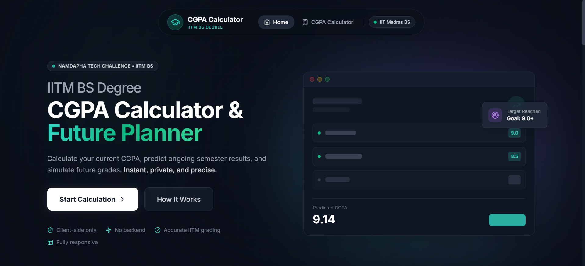
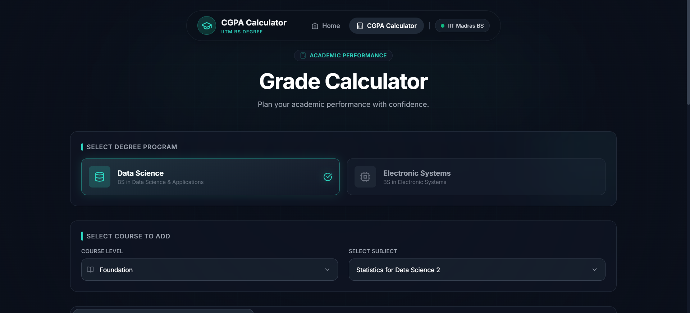
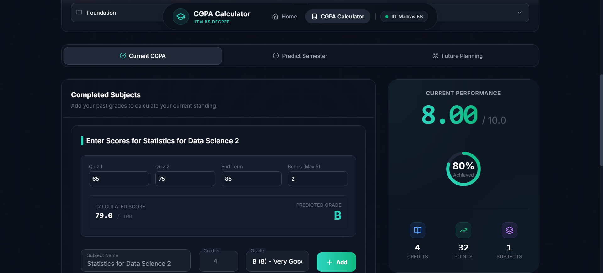

# 🎓 CGPA Calculator & Future Planner


A modern, fully client-side academic performance tool that helps students calculate current CGPA, predict ongoing semester results, and plan future grades with confidence.

Built specifically for IITM BS programs during the Namdapha Tech Challenge, this project focuses on accurate grading logic, clean UX, responsive design, and long-term scalability.

---

## 🌐 Live Website

👉 https://iitmcgpa-calculator.vercel.app/

---

## 📦 GitHub Repository

👉 https://github.com/GaganCods/IITMCGPA-Calculator
---

## 👨‍💻 Creator

**Gagan Pratap**

Solo submission for the Namdapha Tech Challenge.

### 🔗 Connect With Me

- Instagram: https://instagram.com/iamgaganpratap 
- LinkedIn: https://linkedin.com/in/gagan-pratap 
- GitHub: https://github.com/GaganCods 

---

## ✨ What This Web App Does

- 📊 Calculates current CGPA  
- 🔮 Predicts semester performance  
- 🧪 Simulates future grades  
- 🎓 Supports IITM BS programs  
- 📱 Fully responsive  
- ⚡ Instant calculation  
- 🔒 No backend / APIs / DB  
- 🎨 Floating UI, rounded navbar, sticky results panel  

---

## 🧮 CGPA Calculation Formula

CGPA = Σ (Credits × Grade Points) / Σ Credits

---

## 🛠 Tech Stack

- Next.js  
- TypeScript  
- Tailwind CSS  
- shadcn/ui  

---

## 📸 Screenshots

> Stored in `/screenshots` directory.

### 🏠 Landing Page


### 🖥 CGPA Calculator Dashboard


### 📱 Mobile View


### 📊 Results Panel


---

## 🔍 How It Works

1. Select your IITM BS degree program.  
2. Enter completed subjects with credits and grades.  
3. Add ongoing courses to predict results.  
4. Add future subjects to simulate scenarios.  
5. Instantly view CGPA changes in the results panel.

All calculations happen directly in the browser — no servers involved.

---

## 🧑‍💻 Local Development

```bash
git clone https://github.com/GaganCods/IITMCGPA-Calculator
cd IITMCGPA-Calculator
npm install
npm run dev
